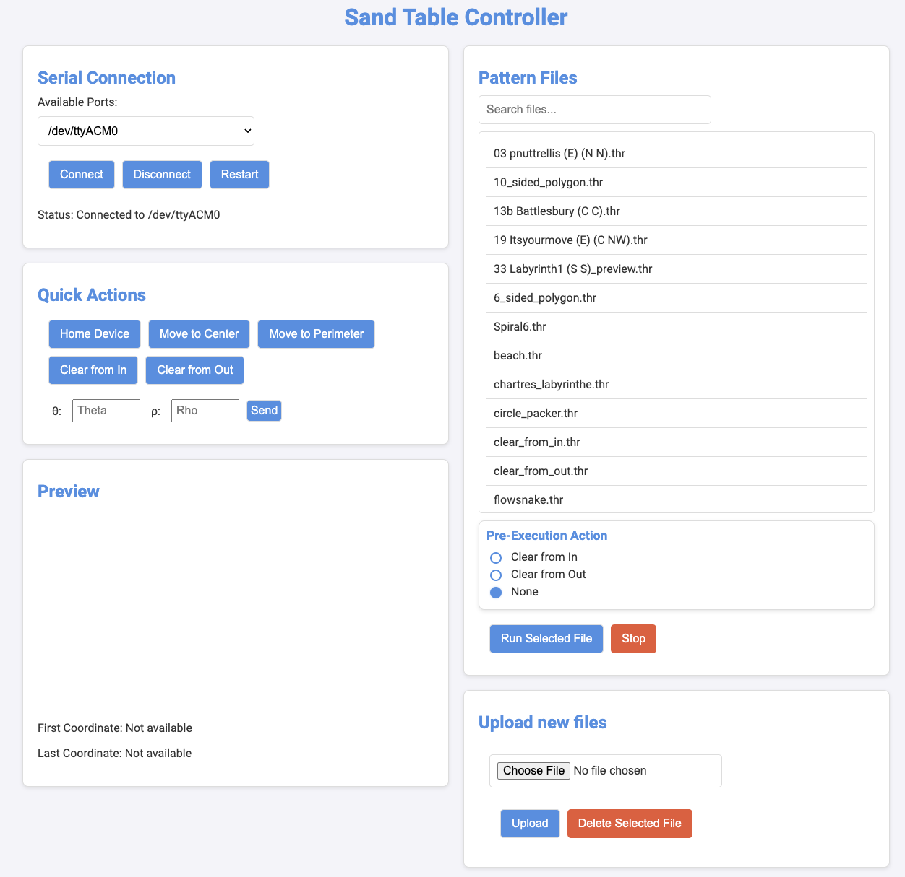

# Dune Weaver


Dune Weaver is a project for a mesmerizing, motorized sand table that draws intricate patterns in sand using a steel ball moved by a magnet. This project combines hardware and software, leveraging an Arduino for hardware control and a Python/Flask-based web interface for interaction.

## Features

- **Theta-Rho Coordinate System**: Supports theta-rho pattern files to generate smooth, intricate designs.
- **Web-Based Control**: Easily upload, preview, and execute patterns via a Flask-based web interface.
- **Batch Execution**: Optimized batching for smoother table movement.
- **Pre-Execution Actions**: Configurable pre-execution clearing actions.
- **Arduino Integration**: Communicates with the Arduino over serial for precise movement control.
- **Real-Time Monitoring**: Continuously reads and displays Arduino responses.

## Technologies Used

- **Python**: Backend application logic and web server.
- **Flask**: Lightweight web framework for serving the UI and handling API calls.
- **Arduino**: Handles the motor control for the sand table.
- **Serial Communication**: Facilitates communication between Python and the Arduino.

## Setup Instructions

### Hardware Requirements

1. A sand table with:
   - A stepper motor
   - Magnet for moving the steel ball
2. Arduino Uno (or compatible microcontroller).
3. DRV8825 motor driver (or an alternative for quieter operation).
4. Power supply and necessary wiring.
5. Computer with USB connection to the Arduino.

### Software Requirements



- Python 3.7+
- Arduino IDE
- Flask
- Serial communication libraries

### Installation Steps

1. Clone the repository:

   ```bash
   git clone https://github.com/tuanchris/dune-weaver.git
   cd dune-weaver
   ```

2. Install the required Python libraries:

    ```bash
    pip install -r requirements.txt
    ```

3. Set up your Arduino:
• Flash the Arduino with the provided firmware to handle serial commands.
• Connect the Arduino to your computer.
4. Run the Flask server:

    ```bash
    python app.py
    ```

5. Access the web interface:
Open your browser and navigate to <http://localhost:8080>.

## File Management

 • Patterns: Save .thr files (theta-rho coordinate files) in the patterns/ directory.
 • Uploads: Upload patterns via the web interface.

## Pattern File Format

Each pattern file consists of lines with theta and rho values (in degrees and normalized units, respectively), separated by a space. Comments start with #.

Example:

```
# Example pattern
0 0.5
90 0.7
180 0.5
270 0.7
```

## API Endpoints

The project exposes RESTful APIs for various actions. Here are some key endpoints:
 • List Serial Ports: /list_serial_ports (GET)
 • Connect to Serial: /connect_serial (POST)
 • Upload Pattern: /upload_theta_rho (POST)
 • Run Pattern: /run_theta_rho (POST)
 • Stop Execution: /stop_execution (POST)

## Project Structure

```
dune-weaver/
├── app.py              # Flask app and core logic
├── patterns/           # Directory for theta-rho files
├── static/             # Static files (CSS, JS)
├── templates/          # HTML templates for the web interface
├── README.md           # Project documentation
├── requirements.txt    # Python dependencies
└── arduino/            # Arduino firmware
```

**Happy sand drawing with Dune Weaver! 🌟**
